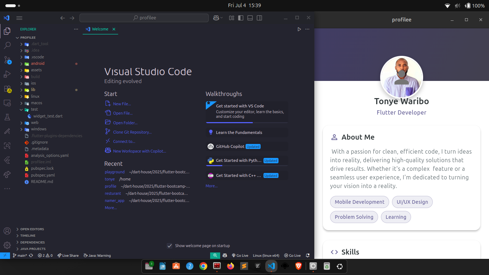

# What came to my mind
## I honestly do have thoughts of how I can possibly create something out of the many ideas that are popping into my head everyday LOL

---
### Let me walk you through some command lines I did to get to this point

<pre><code> 1. mkdir < folder name >
 2. cd < folder name > 
 3. flutter create < app name >
 4. cd < app name >
 5. cd lib/ 
 6. flutter run
</code></pre>

# Professional Profile App I Developed

*A mobile app built with Flutter to showcase my skills and experience for potential employers.*

## About the App

The **Professional Profile App** is a mobile application I developed using the Flutter framework. The app serves as an interactive portfolio, allowing me to present my skills, work experience, and professional background to potential employers.

Some key features of the app include:

- **Detailed Profile**: The app displays my full professional profile, including skill stack,  professional introduction, work history, skills, and achievements.
- **Interactive Timeline**: Users can explore my career timeline and dive into the details of each role and project.
- **Multimedia Showcase**: The app incorporates multimedia elements like images, projects, and documents to provide a rich and engaging experience.
- **Contact Options**: Users can easily get in touch with me through the app, with options to call, email, or connect on social media.

## Getting Started

To run the app on your local machine, follow these steps:

1. Ensure you have Flutter and the necessary dependencies installed on your system. You can find the installation guide [here](https://flutter.dev/docs/get-started/install).
2. Clone the repository to your local machine:
   ```bash
   git clone https://github.com/sprucetonye/profilee.git

3. CD into the downloaded project:
    ```bash
    cd profilee
    ls 
4. What displays, I mean the file structure you see
   ```bash
   analysis_options.yaml
   android
   assets
   build
   ios
   lib
   linux
   macos
   profilee.iml
   pubspec.lock
   pubspec.yaml
   README.md
   test
   web

5. That's amazing seeing how many files you have in your working directory
   ```bash
   cd lib/
   flutter run

6. This is what you gget affter running the app, here is because I don't have Android studio or Xcode. So I am left with this option
   ```bash
   flutter run
   Connected devices:
   Linux (desktop) • linux  • linux-x64      • Ubuntu 25.04 6.14.0-23-generic
   Chrome (web)    • chrome • web-javascript • Google Chrome 136.0.7103.92
   [1]: Linux (linux)
   [2]: Chrome (chrome)
   Please choose one (or "q" to quit): 


! [A screen shot of the running app display]
--
